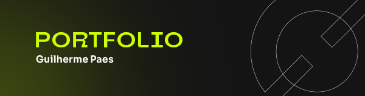

<h1>

</h1>

 

 
 

 

<h3>
    Portfolio desenvolvido com HTML, CSS e JavaScript, o site utiliza a API do GitHub para mostrar os principais projetos desenvolvidos durante minha jornada de estudos e aprendizado como desenvolvedor Full Stack.
</h3>
 
<a href="https://github.com/guipaex/Portfolio" alt="Ver site">Ver Demo</a>
·
<a href="https://github.com/guipaex/Portfolio/issues" alt="Reportar Bug">Reportar Bug</a>
·
<a href="https://github.com/guipaex/Portfolio/issues" alt="Faça uma sugestão">Sugestões</a>

 

## Tecnologias Utilizadas
  
  
  
  

 

<h3 width="100%" style="display:flex; justify-content:center">Feito com por Guilherme Paes.</h3>
